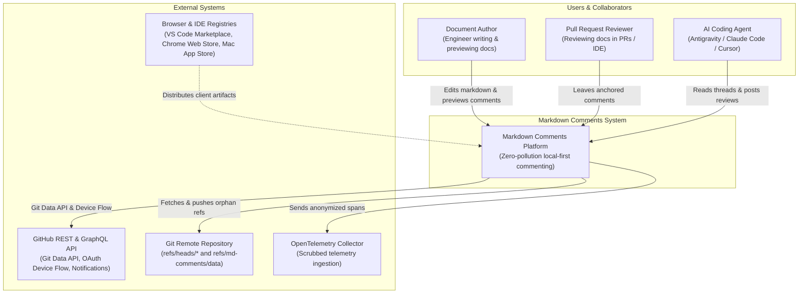
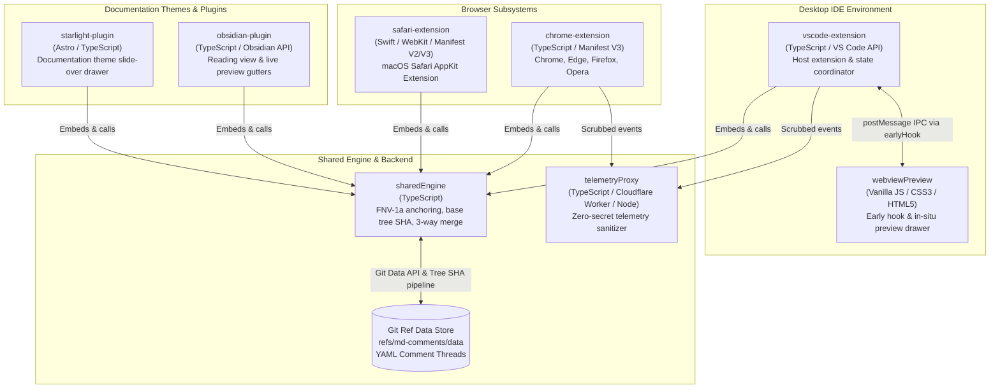
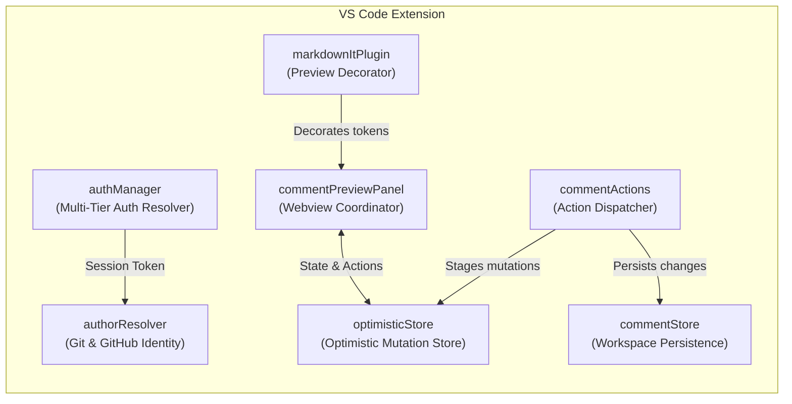
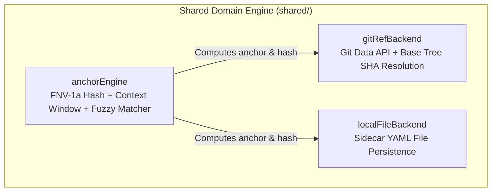

> 🔍 **Interactive Full-Screen Explorer**: Launch the complete [**Interactive LikeC4 Viewer**](/assets/architecture/interactive/index.html) with pan, zoom, and hierarchical drill-down.

### System Context Diagram (Vector)
<p></p>

### Containers Architecture Diagram (Vector)
<p></p>

### VS Code Subsystem Internals (Vector)
<p></p>

[](https://chromewebstore.google.com/detail/markdown-comments/mjlhdjonjfcedkbpajkfeidfebefhkpp)

The Markdown Comments system architecture is formalized using the **C4 Model** (Context, Containers, Components, and Code) specified declaratively in **LikeC4** under [`c4/`](./c4/).

This document describes each layer of the architecture, key design rationales, subsystem boundaries, and instructions for validating and previewing the interactive models.

---

## 1. Architectural Strategy & Design Principles

Markdown Comments is built on five core architectural foundations:

1. **Zero Markdown Pollution**: Comments, threads, reactions, and resolution statuses are never written inline into the document Markdown text. Source repositories remain 100% clean of proprietary markup or HTML tags.
2. **Orphan Git Ref Storage (`refs/md-comments/data`)**: Comments are versioned, collaborated on, and decentralized via Git, stored in an independent orphan Git reference as YAML files without creating merge conflicts with source branches.
3. **Local-First & Multi-Tier Identity**: Desktop IDEs and plugins operate offline or with local sidecars when disconnected. When connected, authentication resolves through a multi-tier fallback chain terminating in RFC 8628 OAuth Device Flow (`INV-OAUTH-ONLY`), without ever requesting raw Personal Access Tokens (PAT).
4. **Optimistic In-Place DOM Mutation (`INV-IN-PLACE-PREVIEW`)**: Native IDE previews patch comment badges, cards, and drawers in-place using synchronous early hooks (`earlyHook.js`) and targeted DOM surgery, eliminating blank screen flicker, scroll jumps, and tab resets.
5. **Zero-Secret Telemetry & Privacy (`INV-ZERO-CLIENT-SECRETS`, `INV-ZERO-CUSTOMER-DATA`)**: No client bundle contains secrets. All telemetry events pass through an anonymization proxy scrubbing document text, author names, and file paths.

---

## 2. Level 1: System Context

The System Context layer defines the boundary of Markdown Comments and its interactions with human engineers, AI agents, and external services.



### Key External Integrations

- **GitHub REST & GraphQL API**: Powers the Git Data API (`/git/trees`, `/git/commits`, `/git/refs`), RFC 8628 Device Authorization Flow, user profile and avatar resolution, and commit comment notifications for `@mentions`.
- **Git Remote Repository**: Stores repository commits and the orphan Git reference `refs/md-comments/data`.
- **OpenTelemetry Backend**: Consumes privacy-scrubbed diagnostic metrics and performance telemetry.

---

## 3. Level 2: Containers

The Container layer decomposes Markdown Comments into deployable runtime artifacts across desktop IDEs, web browsers, knowledge base plugins, and background utilities.



### Container Responsibilities

| Container             | Package                  | Technology               | Core Responsibilities                                                                                                          |
| :-------------------- | :----------------------- | :----------------------- | :----------------------------------------------------------------------------------------------------------------------------- |
| **VS Code Extension** | `vscode-extension`       | TypeScript, VS Code API  | Multi-tier auth, workspace comment state, optimistic mutations, preview decorations, action dispatching                        |
| **Webview Preview**   | `vscode-extension/media` | Vanilla JS, CSS3, HTML5  | Synchronous `earlyHook.js`, in-place DOM patching, floating MD FAB, in-webview confirmation modal, MutationObserver loop guard |
| **Chrome Extension**  | `chrome-extension`       | TypeScript, Manifest V3  | GitHub PR/blob overlay, RFC 8628 OAuth Device Flow, background service worker, storage synchronization                         |
| **Safari Extension**  | `safari-extension`       | Swift, AppKit, WebKit    | macOS native Safari Web Extension container, cross-browser compatibility                                                       |
| **Obsidian Plugin**   | `obsidian-plugin`        | TypeScript, Obsidian API | Local vault markdown commentary, reading view anchors, live preview gutter indicators                                          |
| **Starlight Plugin**  | `starlight-plugin`       | Astro, TypeScript, CSS3  | Astro integration, Starlight documentation theme slide-over drawer, interactive client widget                                  |
| **Shared Engine**     | `shared`                 | TypeScript               | FNV-1a hash anchoring, context windowing, normalized fuzzy cascade, base tree SHA resolution, 3-way merge                      |
| **Telemetry Proxy**   | `infrastructure/`        | TypeScript, Node.js      | PII scrubbing, path sanitization, OpenTelemetry protocol forwarding                                                            |
| **Git Ref Storage**   | N/A (Git Ref)            | YAML on Git Objects      | Decentralized thread storage under `refs/md-comments/data`                                                                     |

---

## 4. Level 3: Subsystem Components

### 4.1 VS Code Extension Internals (`vscodeExt`)



- **`authManager`**: Evaluates credentials across 6 tiers: Active Session $\to$ `context.secrets` $\to$ `globalState` $\to$ `process.env` $\to$ `gh` CLI $\to$ RFC 8628 Device Flow. Emits `onDidChangeAuthState` events.
- **`authorResolver`**: Extracts local Git identity (`user.name`, `user.email`) and enriches with GitHub user profiles and avatars; caches results in an LRU store.
- **`optimisticStore`**: Stages additions, inline edits, reactions, and tombstones in-memory for instant feedback and resilient sequential deletions (`tests/vscode-optimistic-actions.test.ts`).
- **`commentStore`**: Manages the file-to-thread index and coordinates async synchronization with the underlying Git storage backend.
- **`commentActions`**: Handles thread lifecycle operations without triggering intrusive or blocking IDE notification toasts.
- **`commentPreviewPanel` & `markdownItPlugin`**: Registers custom Markdown-It render rules, injects CSS and JS bundles, and handles custom protocol actions (`vscode://markdown-comments/...`).

### 4.2 Webview Preview Runtime Internals (`webviewPreview`)

```mermaid
flowchart TD
  subgraph Webview["Webview Preview Runtime (media/)"]
    EarlyHook["earlyHook.js\nSynchronous API Hook & Poster Polyfill"]
    InplaceDom["inplaceDomUpdater (preview-webview.js)\nIn-Place DOM Patcher & Card Surgery"]
    Modal["confirmationModal\nIn-Webview Deletion Modal"]
    Guard["mutationGuard\nMutationObserver Equality Defense"]
    Anchors["inlineAnchors.js\nText Anchors & Floating MD FAB"]
  end

  EarlyHook -->|Caches acquireVsCodeApi()| InplaceDom
  EarlyHook -->|Queues actions prior to init| InplaceDom
  InplaceDom -->|Prevents recursive loops| Guard
  InplaceDom -->|Triggers delete confirmation| Modal
  Anchors -->|Toggle drawer| InplaceDom
```

- **`earlyHook.js`**: Injected ahead of all other scripts. Synchronously calls `acquireVsCodeApi()`, polyfills the global `poster` object, and buffers user actions during preview bootstrap.
- **`inplaceDomUpdater`**: Directly queries and mutates the DOM tree for comment cards, replies, and reaction counters, preventing the browser engine from resetting scroll offsets, video playback, or tab focus (`INV-IN-PLACE-PREVIEW`).
- **`confirmationModal`**: Displays an accessible, in-situ modal dialog for destructive operations (e.g., deleting threads), avoiding native OS dialog blocking and event propagation bugs (`INV-MODAL-CONFIRMATION`).
- **`mutationGuard`**: Ensures badge counters and attributes are only reassigned when values actually differ, halting infinite MutationObserver re-trigger loops (`INV-MUTATION-GUARD`).
- **`inlineAnchors`**: Applies visual highlights to source text lines corresponding to anchored comments and anchors the floating MD FAB drawer toggle.

### 4.3 Shared Domain Engine Internals (`sharedEngine`)



- **`anchorEngine`**: Computes 32-bit FNV-1a hashes of selected text along with surrounding line context windows. When documents change, executes a tiered fuzzy matching cascade (Exact $\to$ Normalized Whitespace $\to$ Levenshtein Distance).
- **`gitRefBackend`**: Manages the Git Data API transaction pipeline:
  1. Resolves parent commit on `refs/md-comments/data`.
  2. Queries the base tree SHA via `GET /repos/:owner/:repo/git/commits/:sha` (`INV-BASE-TREE-SHA`).
  3. Creates new Git tree objects referencing `base_tree: baseTreeSha`.
  4. Creates commit objects and updates references via `PATCH /repos/:owner/:repo/git/refs/...`.
  5. Implements three-way merging with exponential backoff on push conflicts (`INV-FAST-FORWARD-RETRY`).
- **`localFileBackend`**: Persists comments as `.md-comments.yaml` files alongside documents for non-git workspaces and offline editing.

---

## 5. Level 4: Code & Data Structs

Comment threads are structured as strongly-typed domain entities:

```typescript
export interface CommentAnchor {
  path: string; // Target markdown file path relative to repo root
  startLine: number; // 1-indexed start line
  endLine: number; // 1-indexed end line
  selectedText: string; // Raw selected text snapshot
  contextBefore?: string; // Leading context window for fuzzy re-anchoring
  contextAfter?: string; // Trailing context window for fuzzy re-anchoring
  contentHash: string; // FNV-1a hash of normalized text
}

export interface CommentReaction {
  emoji: string; // e.g. "👍", "❤️", "🚀", "👀"
  authors: string[]; // Usernames who reacted
}

export interface CommentReply {
  id: string; // Unique nanoid
  author: string; // GitHub username or Git config display name
  authorAvatar?: string; // Avatar URL
  createdAt: string; // ISO 8601 timestamp
  body: string; // Markdown body
  reactions?: CommentReaction[];
}

export interface CommentThread {
  id: string; // Unique thread identifier
  anchor: CommentAnchor; // Document anchor binding
  author: string; // Author of original comment
  authorAvatar?: string; // Avatar URL
  createdAt: string; // ISO 8601 timestamp
  body: string; // Top-level comment body
  resolved: boolean; // Thread resolution flag
  resolvedBy?: string; // Resolver username
  resolvedAt?: string; // ISO 8601 resolution timestamp
  replies: CommentReply[]; // Nested discussion replies
  reactions?: CommentReaction[];
}
```

---

## 6. Validating and Previewing LikeC4 Models

The LikeC4 model and view definitions are stored in:

- Model: [`model.c4`](./c4/model.c4)
- Views: [`views.c4`](./c4/views.c4)

### Validation Command

Run the automated offline validation to verify syntax, semantic integrity, and cross-references:

```bash
pnpm likec4 validate --no-layout docs/architecture/c4
```

### Interactive Visualization Dev Server

To launch the interactive LikeC4 web viewer locally:

```bash
pnpm likec4 start docs/architecture/c4
```

This starts a local dev server with full pan/zoom, interactive drill-down navigation from Context $\to$ Container $\to$ Component, and real-time layout rendering.