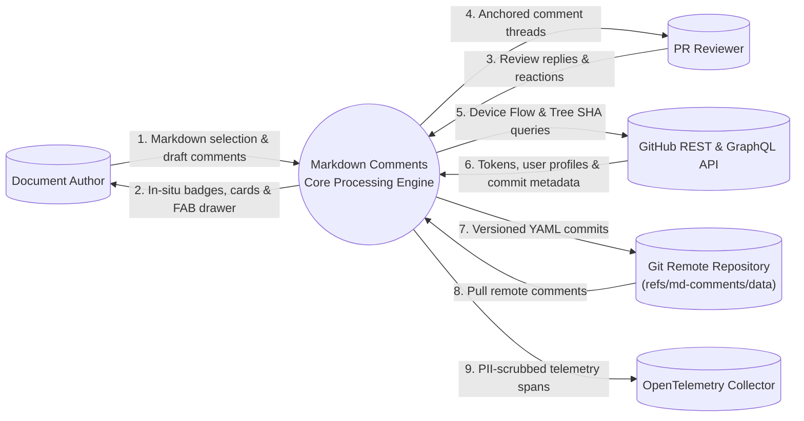
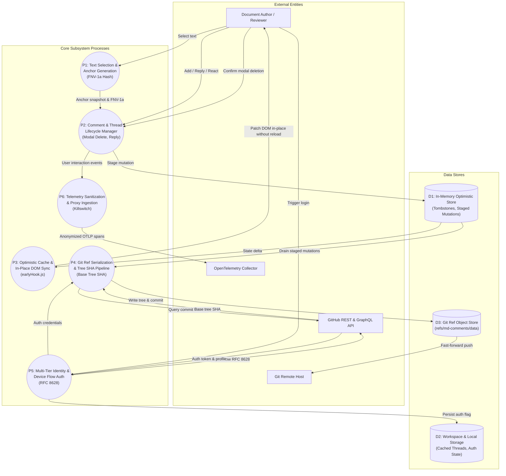
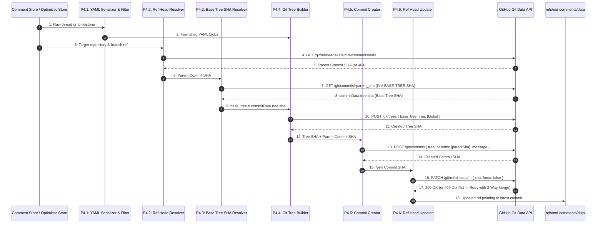

### DFD Level 0: System Context (D2 + ELK)

### DFD Level 1: Subsystem Data Flows P1-P6 (D2 + ELK)

### DFD Level 2: Git Ref & Base Tree SHA Pipeline (D2 + ELK)

This document specifies the Data Flow Diagrams across the Markdown Comments ecosystem. The authoritative D2 models configured with the Eclipse Layout Kernel (`layout-engine: elk`) are maintained in [`dfd/`](./dfd/).

---

## 1. DFD Level 0: System Context

The Level 0 Data Flow Diagram models the macro-level boundary between human contributors, AI agents, external Git/GitHub infrastructure, and the core processing engine.

### Source Model

- File: [`dfd-level-0-context.d2`](./dfd/dfd-level-0-context.d2)
- Engine: `layout-engine: elk`

---

## 2. DFD Level 1: Subsystems Data Flow

The Level 1 DFD decomposes the central processing engine into six discrete processes (**P1** through **P6**) interacting with three persistent and in-memory data stores (**D1**, **D2**, **D3**).

### Process Specifications

1. **P1: Text Selection & Anchor Generation**:
   - Captures selected text range, line numbers, and context windows (preceding and trailing 3 lines).
   - Computes a deterministic 32-bit FNV-1a hash of the normalized content.
2. **P2: Comment & Thread Lifecycle Management**:
   - Handles comment authoring, thread replies, emoji reactions, resolution toggles, and thread deletions.
   - For thread deletions, coordinates with in-preview modal confirmation to prevent accidental loss (`INV-MODAL-CONFIRMATION`).
3. **P3: Optimistic Cache & In-Place DOM Synchronization**:
   - Hooks into webview lifecycle early via `earlyHook.js`, polyfilling `poster` and queuing dispatches.
   - Performs surgically targeted DOM updates in `preview-webview.js` without reloading the document DOM (`INV-IN-PLACE-PREVIEW`).
   - Applies strict text-equality checks before mutating badge counters, eliminating recursive MutationObserver loops (`INV-MUTATION-GUARD`).
4. **P4: Git Ref Serialization & Tree SHA Pipeline**:
   - Formats thread entities as human-readable YAML.
   - Queries `GET /git/commits/:sha` to retrieve the parent commit's base tree SHA (`INV-BASE-TREE-SHA`).
   - Creates Git tree and commit objects and updates `refs/md-comments/data` with 3-way merge and fast-forward retries (`INV-FAST-FORWARD-RETRY`).
5. **P5: Multi-Tier Identity & RFC 8628 Device Flow**:
   - Resolves credentials along a 6-tier fallback chain: Session $\to$ `context.secrets` $\to$ `globalState` $\to$ `process.env` $\to$ `gh` CLI $\to$ Device Code Flow.
   - Persists state in `globalState` and broadcasts `onDidChangeAuthState` (`INV-AUTH-PERSISTENCE`).
6. **P6: Telemetry Sanitization & Proxy Ingestion**:
   - Scrubs all PII, document text, and file paths (`INV-ZERO-CUSTOMER-DATA`).
   - Operates with zero client secrets (`INV-ZERO-CLIENT-SECRETS`) and halts immediately if disabled (`INV-TELEMETRY-KILLSWITCH`).

### Source Model

- File: [`dfd-level-1-subsystems.d2`](./dfd/dfd-level-1-subsystems.d2)
- Engine: `layout-engine: elk`

---

## 3. DFD Level 2: Storage & Ref Pipeline

The Level 2 DFD details the exact sequence of data transformations and GitHub Git Data API calls required to persist comment threads without corrupting orphan commit trees.

### Critical Storage Invariants

- **Base Tree SHA Resolution (`INV-BASE-TREE-SHA`)**: The GitHub Git Data API requires `base_tree` to be the SHA of a **Tree** object, not a Commit object. Passing a commit SHA generates an unrecoverable `422 Unprocessable Entity`. The pipeline queries `GET /git/commits/:sha` and extracts `data.tree.sha`.
- **Fast-Forward Conflict Resolution (`INV-FAST-FORWARD-RETRY`)**: If concurrent updates produce a `409 Conflict` during `PATCH /git/refs/...`, the system performs a three-way merge against the newly advanced remote ref with exponential jittered backoff.

### Source Model

- File: [`dfd-level-2-storage.d2`](./dfd/dfd-level-2-storage.d2)
- Engine: `layout-engine: elk`