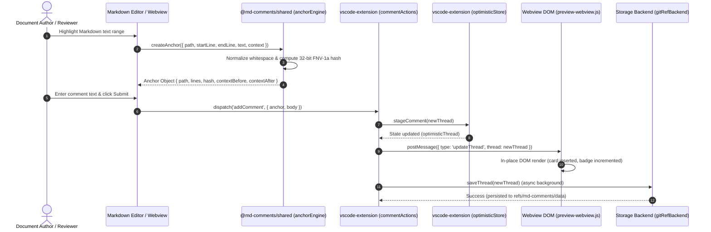
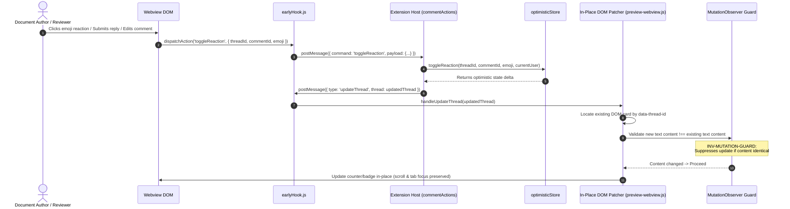
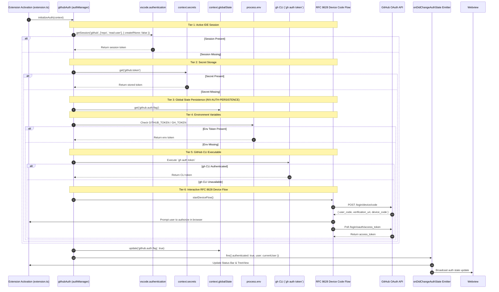
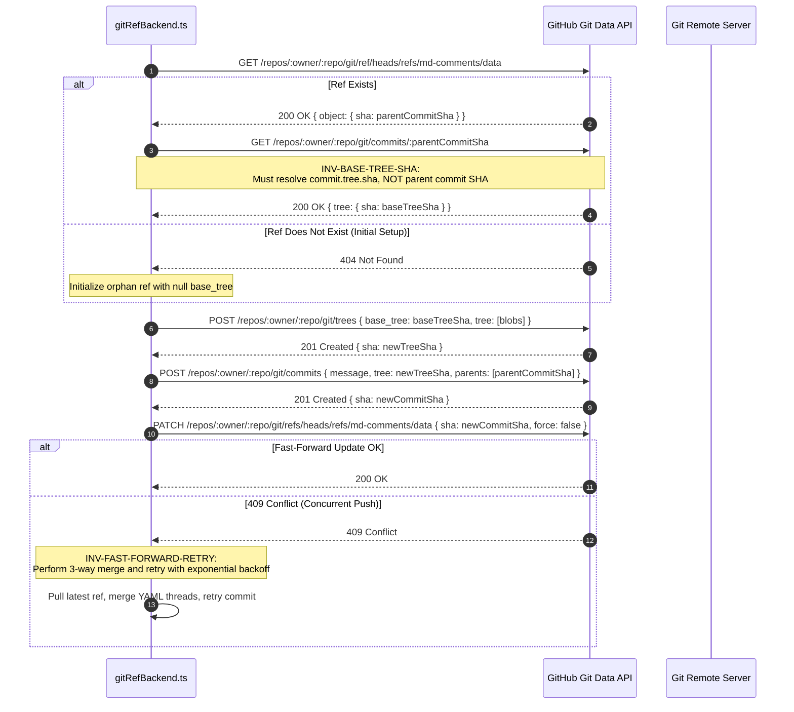
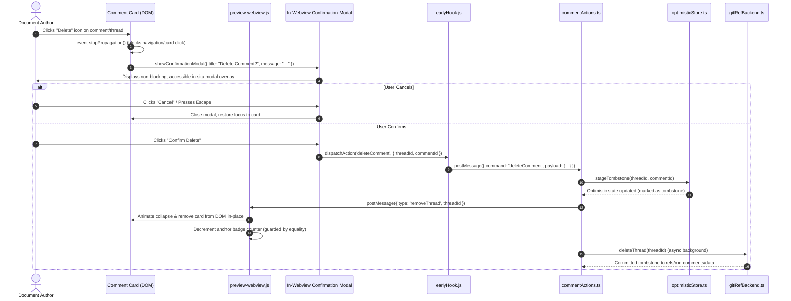
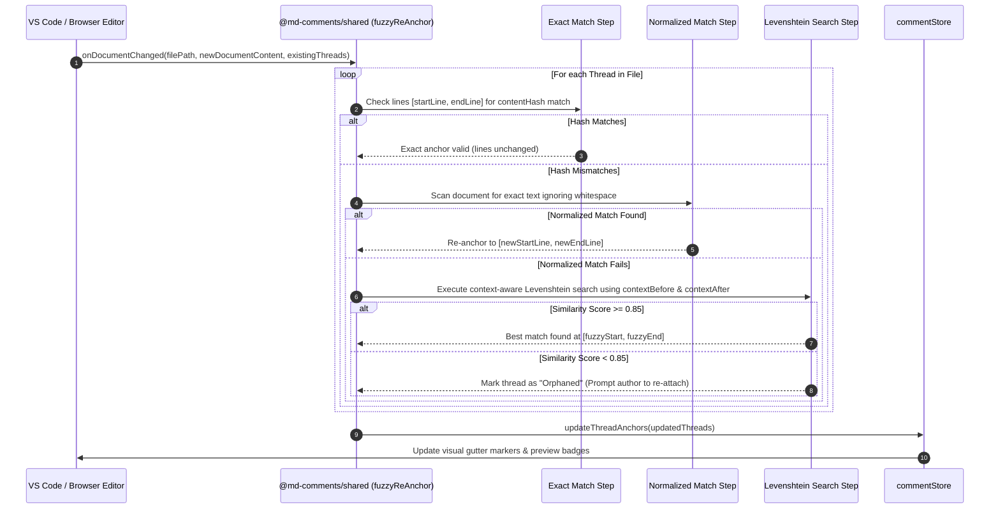
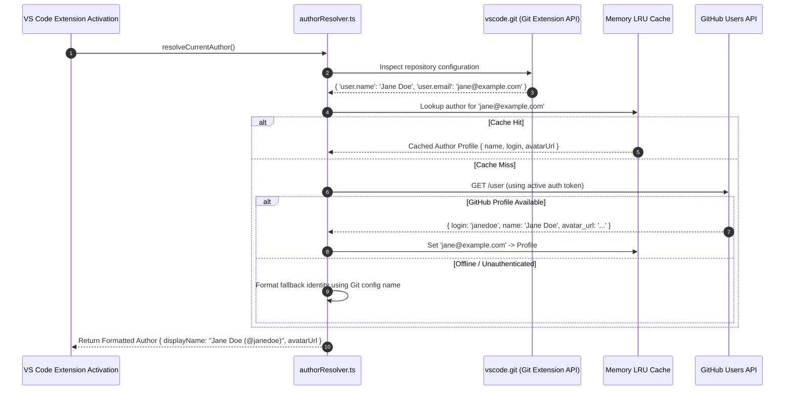
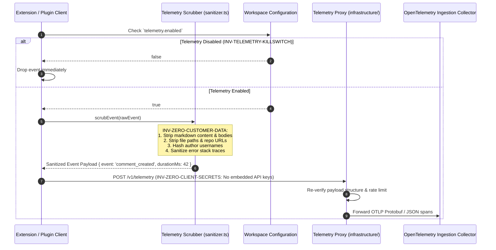

This document specifies the eight core runtime lifecycles of Markdown Comments using detailed sequence diagrams.

---

## Sequence 1: Text Selection, FNV-1a Hash Anchoring & Comment Creation

Documents the journey from a user highlighting Markdown text to an anchored comment thread being optimistically rendered and staged for storage.

---

## Sequence 2: Thread Reply, Reaction, Edit & In-Place Optimistic Preview Sync

Captures the real-time optimistic update flow. The webview communicates through `earlyHook.js` to dispatch actions, mutating the DOM immediately without refreshing the document.

---

## Sequence 3: Multi-Tiered Authentication & Token Persistence Lifecycle

Details the 6-tier fallback chain used by the VS Code extension to authenticate users, persist credentials, and broadcast state changes across preview webviews.

---

## Sequence 4: Git-Ref Tree & Commit Pipeline with Base Tree SHA Resolution

Illustrates how comments are committed to `refs/md-comments/data` via the GitHub Git Data API, resolving the base tree SHA to prevent orphan tree corruption (`INV-BASE-TREE-SHA`).

---

## Sequence 5: Resilient Comment Deletion & In-Preview Modal Confirmation Flow

Shows the safe, non-disruptive deletion workflow that protects against accidental deletions, input focus loss, and thread resurrection.

---

## Sequence 6: Markdown Mutation & Fuzzy Re-Anchoring Cascade

When the user modifies a Markdown file, existing comments must re-bind to shifted line numbers without failing or losing context.

---

## Sequence 7: Author Identity Resolution & Display Name Formatting

Ensures that comment authors are clearly identified using Git configuration identities and enriched with GitHub avatars and user profiles.

---

## Sequence 8: Privacy-Preserving Telemetry Event Pipeline

Enforces the telemetry invariants (`INV-ZERO-CLIENT-SECRETS`, `INV-ZERO-CUSTOMER-DATA`, `INV-TELEMETRY-KILLSWITCH`).

