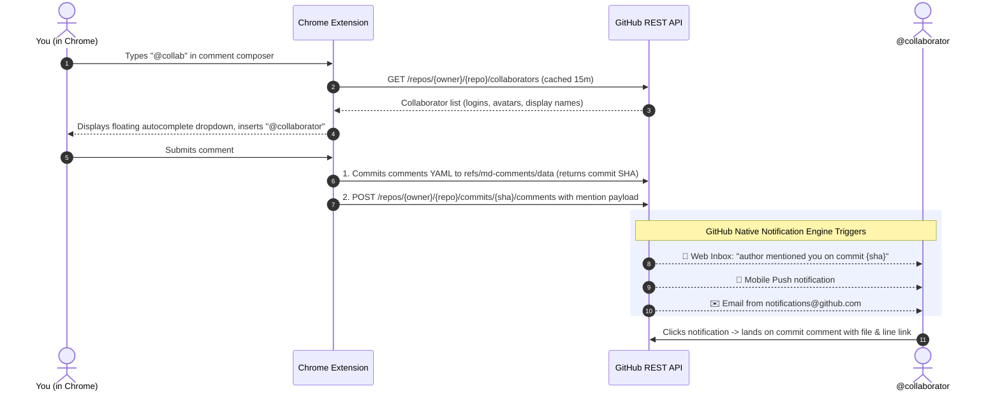

# Markdown Comments - GitHub Chrome Extension

[](https://chromewebstore.google.com/detail/markdown-comments/mjlhdjonjfcedkbpajkfeidfebefhkpp)
[](https://chromewebstore.google.com/detail/markdown-comments/mjlhdjonjfcedkbpajkfeidfebefhkpp)

A privacy-first browser extension that brings rich, interactive Markdown commenting, `@mention` collaborator tagging, and 100% native GitHub notifications directly to GitHub.

---

## 🚀 Key Features

- **Inline Text & Paragraph Commenting**: Highlight any text passage or click the `+` icon on any Markdown paragraph to open an inline composer.
- **`@mention` Collaborator Autocomplete**: Type `@` in any comment or reply box to trigger an instant autocomplete dropdown populated directly from repository collaborators and assignees with avatars and names.
- **100% Native GitHub Notifications**: Tagging `@username` automatically dispatches alerts through native GitHub notification channels:
  - 🔔 **GitHub Web Notification Center** (`github.com/notifications`)
  - 📱 **GitHub Mobile App** (instant push notifications on iOS & Android)
  - ✉️ **GitHub Email** (`notifications@github.com` sent directly to the user's registered address)
  - Notifications are attached to the data commit on `refs/md-comments/data` with direct links back to the reviewed file and line number.
- **Zero Branch Clutter**: Comments auto-save to custom git references (`refs/md-comments/data`) outside standard branch trees (`refs/heads/*`)—leaving zero commits on `main` and zero PR overhead.
- **Dedicated Comments Workspace & Floating Sidebar**:
  - Automatically adds a **Comments** tab to the GitHub PR navigation bar.
  - Floating toggle widget in the bottom-right corner provides access to comments across any page.
- **Threaded Discussions & Reactions**: Reply in nested threads, resolve discussions, and react with emojis.
- **Fuzzy Re-Anchoring**: Comments stay securely attached to their target text even as documents are edited or refactored.

---

## 📥 Installation

### From the Chrome Web Store

Install the extension directly from the [Chrome Web Store](https://chromewebstore.google.com/detail/markdown-comments/mjlhdjonjfcedkbpajkfeidfebefhkpp).

### Local Development Setup

To load and test the extension locally:

1. Clone this repository and install dependencies at the monorepo root:
   ```bash
   pnpm install
   ```
2. Build the extension package:
   ```bash
   pnpm build:chrome
   ```
3. Open Google Chrome and navigate to `chrome://extensions/`.
4. Turn on **Developer mode** using the toggle switch in the top right.
5. Click **Load unpacked** in the top left and select the `chrome-extension/dist/` directory.

To watch for changes during development:

```bash
pnpm watch:chrome
```

---

## 💡 How It Works

### Collaborator Autocomplete & Native Notifications



### Zero Configuration

- **Zero third-party services**: No Slack webhooks, No Microsoft Teams apps, No Resend/SMTP gateways.
- **Zero mapping files**: Uses your collaborators' real GitHub logins directly.
- **Zero extra tokens**: Uses your existing GitHub OAuth or Personal Access Token with standard `contents: write` repository permissions.

---

## ⚙️ Extension Options

Right-click the Markdown Comments extension icon in Chrome's toolbar and select **Options** to configure:

- **GitHub Token**: Personal Access Token (PAT) used for private repositories or to increase API rate limits.
- **Conventional Commits**: Optional conventional commit message formatting for ref writes (`docs(comments): ...`).
- **Batch Comments**: Buffer multiple comment actions together.

---

## 🔒 Security & Privacy

- All API communications occur directly between your browser and the official GitHub REST API (`api.github.com`).
- No comment text, document contents, or authentication tokens are ever transmitted to third-party servers.
- See our full [Privacy Policy](../PRIVACY.md) and [Security Guide](../SECURITY.md) for details.
