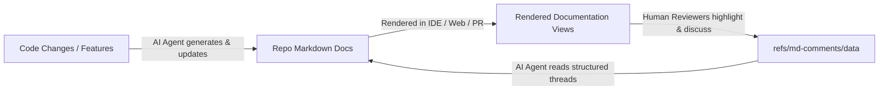

# Agentic AI & Documentation Workflows

> ### **AI-Orchestrated Docs. Human-Orchestrated Comments.**
>
> Docs live directly in your repository, and comments live as a native layer on top, never locked in third-party SaaS silos. AI agents orchestrate the documentation as code evolves, while humans orchestrate the reviews and discussions on rendered views.

This repository is engineered for a seamless collaboration loop between AI coding agents and human reviewers.

---

## 🔄 The AI-Human Documentation Loop

### 1. AI-Orchestrated Documentation

- **Clean Markdown in the Repository**: AI agents (Antigravity, Cursor, Claude Code, GitHub Copilot) create and maintain technical specifications, guides, and architectural docs alongside source code.
- **Zero Inline HTML Pollution**: Unlike legacy comment systems that insert `<!-- comment id="abc" -->` tags directly into markdown files, Markdown Comments stores comments outside your source branches (`refs/md-comments/data`). LLM prompts, token budgets, and AST parsers stay 100% clean and free of noise or merge conflicts.

### 2. Human-Orchestrated Comments on Rendered Views

- **Visual Review Everywhere**: Engineers, product managers, and team members review the documentation where it looks best—rendered previews in VS Code/Cursor/Antigravity, live Astro/Starlight documentation sites, Obsidian knowledge bases, or GitHub PR diffs.
- **Fuzzy Anchoring Cascade**: Comments anchor to exact sentences and paragraphs using normalized FNV-1a hashes and fuzzy text matching, surviving document edits and refactoring passes.

### 3. Agentic Resolution & Iteration

- **Git-Native Storage**: Comment threads and status (Open / Resolved) are versioned in `refs/md-comments/data` as structured YAML/JSON.
- **Agent Consumption**: AI coding agents can read these threads to understand human feedback, apply requested updates to the markdown documentation or codebase, and resolve feedback loops directly.

---

## 🛠️ AI Review & Developer Commands

When pair-programming with an Antigravity coding assistant or using local agent skills, you can invoke the following workflows:

1. **Over-Engineering & Bloat Audit (`/ponytail-review` / `/ponytail-audit`)**:
   - Instructs the agent to check your diff or repository for unnecessary abstractions, dead code, or reinvented standard library utilities.
   - Recommends minimal, maintainable implementations.

2. **Ultra-Compressed Code Review (`/caveman-review`)**:
   - Requests a dense, high-signal review outputting one line per finding (location, problem, suggested fix) to conserve context window space.

3. **Conventional Commit Generator (`/caveman-commit`)**:
   - Generates minimal and meaningful Conventional Commits based on staged diffs, maintaining clean git logs.

4. **Repository Briefing & Context Density (`/context-pack`)**:
   - Compiles a high-signal briefing of key files, entry points, and active changes to orient coding agents without costly repository scans.

5. **Semantic Code Intelligence & Call Graphs (`/codegraph`)**:
   - Pre-indexed local knowledge graph (`.codegraph/`) parsing TypeScript, JavaScript, Python, and Astro ASTs into symbols and call relationships.
   - Allows agents to explore architectures, trace cross-package callers/callees, analyze blast radius (`codegraph impact`), and identify affected test suites (`codegraph affected`) in one shot without crawling directories or reading raw files repeatedly.

---

## 🔒 Security Static Analysis (SAST) & Pre-Commit Checks

- **Automated Verification**: Run `pnpm check` to execute dependencies audit, ESLint security rules, Prettier formatting, TypeScript static checks, and unit tests before committing changes.
- **FOSSA Compliance**: Local and CI scans ensure full license and third-party dependency compliance.
