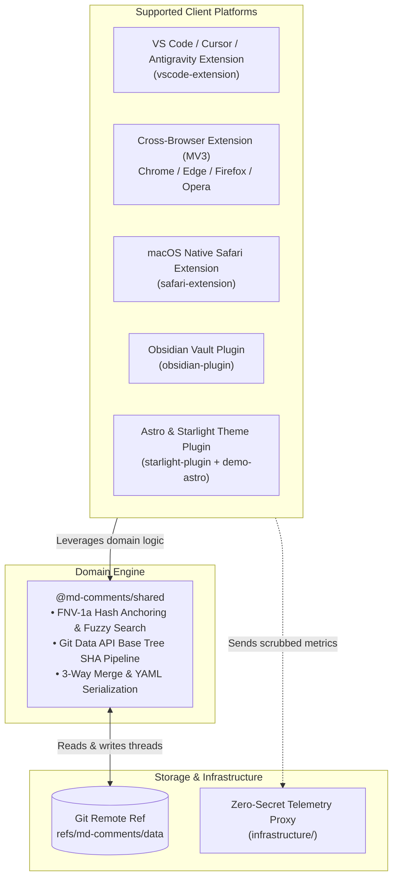

# Markdown Comments System Architecture

Welcome to the definitive architecture documentation for **Markdown Comments**, a multi-platform, local-first documentation review and commenting system for Markdown files.

---

## 1. Core Architectural Tenets

Markdown Comments is engineered around four non-negotiable architectural guarantees:

1. **Zero Markdown Pollution**: The system never injects HTML comments, tags, or proprietary anchor codes into user markdown files. The source branch and documents remain pristine.
2. **Decentralized Git-Native Storage**: Comment threads and discussion lifecycles are persisted as YAML documents directly inside an orphan Git reference (`refs/md-comments/data`), providing versioning, diffability, and offline autonomy without database dependencies.
3. **Local-First & Multi-Tier Identity**: Desktop IDEs and plugins function completely offline with local sidecars, seamlessly synchronizing when connected. Authentication resolves along a multi-tiered fallback chain culminating in RFC 8628 OAuth Device Flow (`INV-OAUTH-ONLY`). Personal Access Tokens (PATs) are prohibited.
4. **Optimistic In-Place DOM Surgery (`INV-IN-PLACE-PREVIEW`)**: Native IDE previews patch comment badges, cards, and drawers in-place using early hooks (`earlyHook.js`) and surgical DOM updates, eliminating blank screen flicker, scroll jumps, and tab resets.

---

## 2. Architecture Documentation Suite

The architecture documentation is organized across specialized layers:

| Document                                                  | Purpose                                                                                  | Modeling Tool / Standard      |
| :-------------------------------------------------------- | :--------------------------------------------------------------------------------------- | :---------------------------- |
| [**C4 Architecture Model**](./c4-architecture.md)         | System Context, Container topology, Component internals, and Code structures             | **LikeC4** (`.c4`)            |
| [**Data Flow Diagrams**](./data-flow-diagrams.md)         | Level 0 Context, Level 1 Subsystems, and Level 2 Storage pipelines                       | **D2** (`layout-engine: elk`) |
| [**Components Integration**](./components-integration.md) | Monorepo package communication, IPC protocol, and webview messaging                      | **D2** (`layout-engine: elk`) |
| [**Sequence Diagrams**](./sequence-diagrams.md)           | Step-by-step runtime lifecycles (Anchoring, Auth, Storage, Modal Deletion, Re-anchoring) | Mermaid & D2                  |
| [**Invariants & ADRs**](./invariants-and-adrs.md)         | Formal system invariants (`INV-*`) and Architectural Decision Records                    | GFM Markdown                  |

---

## 3. High-Level Subsystems

---

## 4. Modeling Toolchain & Automated Drift Defense

- **LikeC4 Engine**: Model source files reside in [`model.c4`](./c4/model.c4) and views in [`views.c4`](./c4/views.c4). Verified offline via `pnpm likec4 validate --no-layout docs/architecture/c4`.
- **D2 with ELK Engine**: Data flow and integration diagrams reside in [`dfd/`](./dfd/) and [`components-integration.d2`](./components-integration.d2), all configured with `layout-engine: elk`.
- **Automated Verification Harness**: Tested in CI and pre-commit via `node scripts/verify-architecture-docs.mjs` and `tests/architectureDocs.test.ts`.
- **Agent Skill & Workflow**: Maintainers and AI agents use [`.agents/skills/architecture-docs/SKILL.md`](../../.agents/skills/architecture-docs/SKILL.md) and `/architecture-sync` to keep architecture models in lockstep with codebase evolution.
