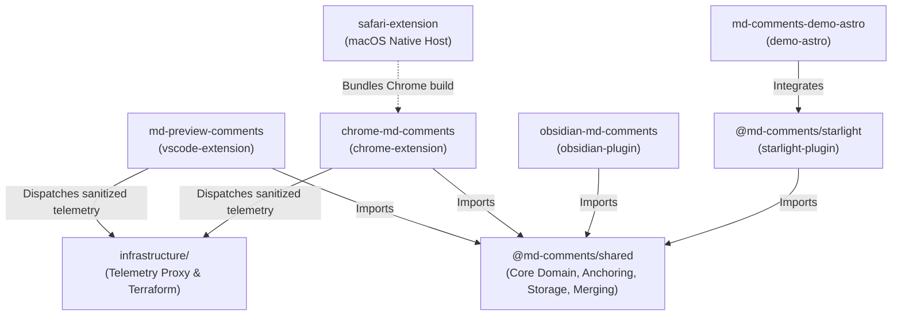
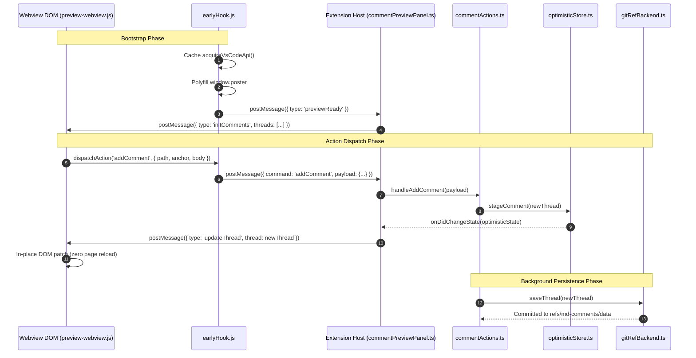

# Component Integration & Communication Matrix

Markdown Comments is structured as a monorepo consisting of shared domain libraries, platform-specific client applications, and cloud proxy infrastructure. This document details the component boundaries, IPC channels, webview messaging protocols, and integration topologies across packages.

The primary D2 integration model using the ELK layout engine (`layout-engine: elk`) is defined in [`components-integration.d2`](./components-integration.d2).

---

## 1. Monorepo Package Topology

### Package Catalog

| Package Directory   | NPM Package Name         | Environment                      | Responsibilities                                                                                        |
| :------------------ | :----------------------- | :------------------------------- | :------------------------------------------------------------------------------------------------------ |
| `shared/`           | `@md-comments/shared`    | Universal Node / Browser         | FNV-1a anchor hashing, fuzzy re-anchoring cascade, YAML serialization, Git Data API client, 3-way merge |
| `vscode-extension/` | `md-preview-comments`    | VS Code Extension Host & Webview | In-situ preview drawer, early hook, author resolution, optimistic mutation store, multi-tier auth       |
| `chrome-extension/` | `chrome-md-comments`     | Chromium, Firefox, Edge, Opera   | GitHub PR & Markdown file overlay, background service worker, RFC 8628 OAuth Device Flow                |
| `safari-extension/` | `safari-extension`       | macOS native Safari              | Native AppKit wrapper hosting the Safari Web Extension build                                            |
| `obsidian-plugin/`  | `obsidian-md-comments`   | Obsidian Desktop & Mobile        | Vault markdown commentary, reading view anchors, live preview gutter indicators                         |
| `starlight-plugin/` | `@md-comments/starlight` | Astro / Node.js                  | Theme plugin for Astro/Starlight documentation sites with client-side interactive drawer                |
| `demo-astro/`       | `md-comments-demo-astro` | Astro Static Site                | Reference documentation site integrating `@md-comments/starlight`                                       |
| `infrastructure/`   | N/A                      | Cloudflare / Node / Terraform    | Zero-secret OpenTelemetry sanitization proxy and cloud deployment infrastructure                        |

---

## 2. VS Code Extension & Webview IPC Protocol

The desktop IDE extension communicates with the in-situ preview webview via a bidirectional message bridge:

### IPC Message Types

#### Webview $\to$ Extension Host

- `addComment`: Dispatches creation of a new top-level comment thread anchored to a line range.
- `addReply`: Appends a reply to an existing comment thread.
- `editComment`: Updates the Markdown body of an existing comment or reply.
- `deleteComment`: Requests deletion of a comment or thread (preceded by in-webview modal confirmation).
- `toggleReaction`: Toggles an emoji reaction on a comment card.
- `resolveThread`: Toggles resolution status of a thread.
- `previewReady`: Notifies extension host that early hook and DOM handlers are bound.

#### Extension Host $\to$ Webview

- `initComments`: Supplies the full array of comment threads on document open or refresh.
- `updateThread`: Broadcasts an in-place patch for a modified, added, or resolved thread.
- `removeThread`: Instructs the webview to collapse and remove a thread card in-place.
- `authStateChanged`: Updates webview user profile indicator and auth-dependent controls.

---

## 3. Cross-Browser Communication Architecture

The browser extension (`chrome-extension`) targets Chrome, Edge, Firefox, and Safari via WebExtensions standards:

```mermaid
flowchart LR
  subgraph ContentScript["Content Script Context (GitHub Webpage)"]
    DOMWatcher["DOM Mutation Observer\n(Detects PR/Blob Markdown views)"]
    GutterWidget["Gutter Anchor Decorator"]
    OverlayDrawer["Interactive Comment Drawer"]
  end

  subgraph ServiceWorker["Background Service Worker"]
    AuthModule["RFC 8628 Device Flow Client\n(Zero-PAT Enforced)"]
    SyncModule["Git Storage Sync Worker"]
    BadgeMgr["Action Badge Manager"]
  end

  subgraph SharedEngine["@md-comments/shared"]
    Anchor["Anchor Hash & Fuzzy Re-Anchoring"]
    GitAPI["GitHub Git Data API Client"]
  end

  DOMWatcher -->|Trigger overlay| GutterWidget
  GutterWidget -->|Open drawer| OverlayDrawer
  OverlayDrawer <-->|chrome.runtime.sendMessage| ServiceWorker
  ServiceWorker -->|Invokes| SharedEngine
```

---

## 4. Component Resilience & Defenses

- **In-Place DOM Mutation (`INV-IN-PLACE-PREVIEW`)**: Native previews must update comment cards, reactions, and threads without refreshing the markdown document DOM, preventing blank screen flash, video reloads, and scroll disruption.
- **MutationObserver Equality Guard (`INV-MUTATION-GUARD`)**: The preview DOM counter listener verifies that text content has actually changed before updating inner text or classes, stopping runaway 100% CPU loops.
- **Resilient Sequential Deletions**: Deletion actions are confirmed in-webview (`INV-MODAL-CONFIRMATION`) and committed with optimistic tombstones, preventing deleted threads from resurfacing during concurrent sync sweeps.
